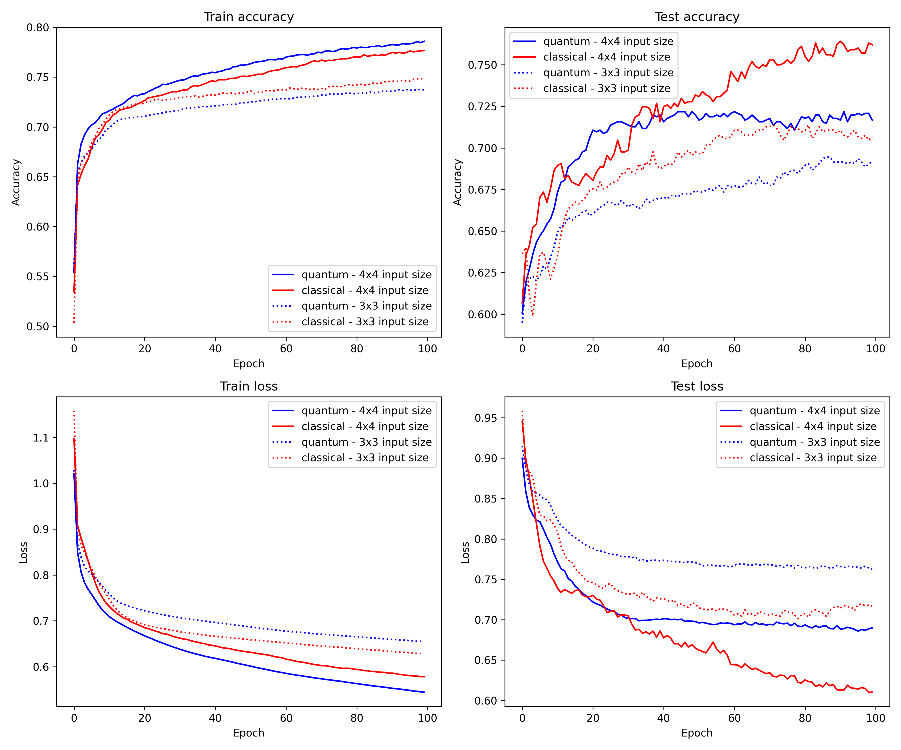

# HQCCNN

Here we implement the Hybrid Quantum Classical Convolutional Neural Network (HQCCNN) described in the paper [An Image Classification Algorithm Based on Hybrid Quantum Classical Convolutional Neural Network](https://www.hindawi.com/journals/que/2022/5701479/) by Li et al.  This paper utilized the HQCCNN to classify handwritten digits from the [MNIST](http://yann.lecun.com/exdb/mnist/) dataset.  Here we employ the model to classify land cover from the [DeepSat4](https://csc.lsu.edu/~saikat/deepsat/) dataset.

As the images from this dataset contain 4 channels instead of the single channels present in MNIST, we first collapse the channels into a single channel using a pixel-wise mean, and then downsample to the required input shape of the network using an average pooling operation.  Moreover, due to limited availability of computing power, we take only 10000 images for training and testing with a 90%-10% split, respectively, instead of the full 500000 available images.

The HQCCNN uses 2 quantum convolutional kernels, each with an associated pooling operation.  It was trained for 100 epochs with a batch size of 32 and learning rate of 0.001.  A classical convolutional network with an equivalent architecture utilizing classical convolution layers was also created and trained under the same condition.  These models were both trained and evaluated using input image size of (4, 4) and (3, 3). cThe results of training are shown below.

A quantum model using 4 quantum convolutional kernels was also created and compared to the previous.  The results are shown below.

Despite the significant downsampling and size reduction of the dataset, we obtain moderate classification accuracy in both the classical and quantum networks.  However, cotradictory to the original paper, the quantum network consistently performs worse than its classical equivalent.